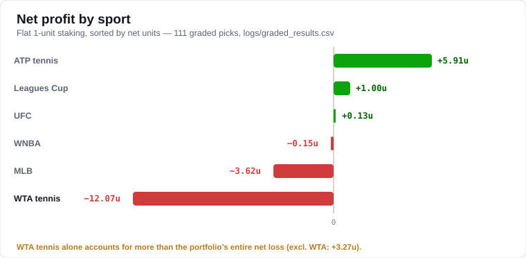
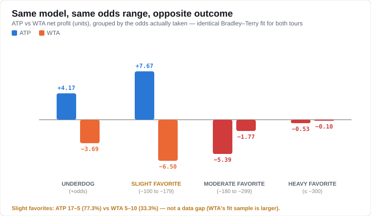
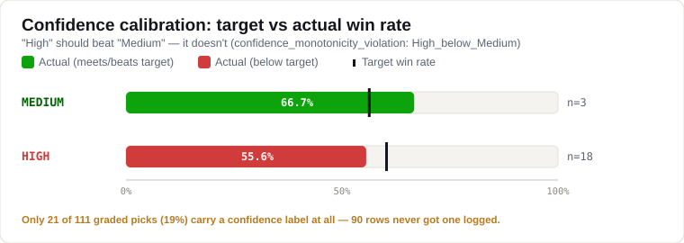

# Model Performance & Diagnostics

Real graded-pick record, calibration diagnostics, and the WTA overconfidence
fix, for anyone picking this project up. Every number below is computed
directly from the files named in [Methodology](#methodology) &mdash; nothing
here is illustrative.

**Snapshot as of 2026-09-01:** 111 graded picks &middot; 62&ndash;49 (55.9%) &middot;
**net &minus;8.79 units** (flat 1-unit staking) &middot; betting readiness gate
**70/100, not ready**.

Win rate alone looks fine. Net profit says otherwise &mdash; that gap is the
subject of this whole page.

## Profit by sport

| Sport | Record | Win % | Profit (units) |
|---|---:|---:|---:|
| ATP tennis | 36&ndash;19 | 65.5% | **+5.91** |
| Leagues Cup | 1&ndash;0 | 100.0% | +1.00 |
| UFC | 2&ndash;1 | 66.7% | +0.13 |
| WNBA | 1&ndash;1 | 50.0% | &minus;0.15 |
| MLB | 3&ndash;5 | 37.5% | &minus;3.62 |
| **WTA tennis** | 19&ndash;23 | 45.2% | **&minus;12.07** |

WTA tennis alone is a bigger loss than the portfolio's entire net result.
Exclude it and the record above reads **+3.27 units**, not &minus;8.79. Every
other sport except MLB is at small-sample sizes (n &le; 8) and shouldn't be
acted on either way yet.

## Same model, same odds range, opposite outcome

ATP and WTA run through the identical Bradley&ndash;Terry rating fit in
[`sports/tennis.py`](sports/tennis.py). Grouped by the odds actually taken:

| Odds bucket | ATP record | ATP profit | WTA record | WTA profit |
|---|---:|---:|---:|---:|
| Underdog (+odds) | 6&ndash;3 (66.7%) | +4.17 | 3&ndash;7 (30.0%) | &minus;3.69 |
| **Slight favorite (&minus;100 to &minus;179)** | **17&ndash;5 (77.3%)** | **+7.67** | **5&ndash;10 (33.3%)** | **&minus;6.50** |
| Moderate favorite (&minus;180 to &minus;299) | 8&ndash;9 (47.1%) | &minus;5.39 | 8&ndash;5 (61.5%) | &minus;1.77 |
| Heavy favorite (&le; &minus;300) | 5&ndash;2 (71.4%) | &minus;0.53 | 3&ndash;1 (75.0%) | &minus;0.10 |

The **slight favorite** bucket is the clearest split, and it isn't a
data-scarcity problem: at the time this was measured, WTA's fitted rating
sample (713 players / 4,764 results) was *larger* than ATP's
(473 / 3,191). The real issue is structural &mdash; WTA's flatter,
more parity-driven talent distribution means the same rating gap represents
less true predictive signal than it does on ATP, and the shared fit didn't
correct for that.

**Fix, committed 2026-09-01:** `WTA_RATING_L2_PENALTY = 0.20` (vs ATP's
`0.05`) in `sports/tennis.py` shrinks WTA rating gaps toward zero before
they reach the probability conversion. Verified on live data at commit time:
WTA's fitted rating spread (stdev) dropped from 1.62 to 1.00. **The record
above predates the fix** &mdash; none of these graded picks ran under the
corrected model. Re-pull this table after WTA picks accumulate under it.

## Confidence calibration

A "High confidence" pick should win more often than a "Medium confidence"
one. In the real record it doesn't &mdash; `reports/model_governance_report.json`
flags this as `confidence_monotonicity_violation: High_below_Medium`.

| Confidence label | Record | Win % | Target % | Profit |
|---|---:|---:|---:|---:|
| Medium | 2&ndash;1 | 66.7% | 56.0% | +1.06 |
| High | 10&ndash;8 | 55.6% | 60.0% | &minus;3.29 |
| *No label recorded (81% of rows)* | 50&ndash;40 | 55.6% | &mdash; | &minus;6.57 |

90 of 111 graded rows never got a confidence label carried through to
grading &mdash; a separate plumbing gap from the probability-logging one fixed
2026-08-31. The calibration read above is real but only covers 19% of the
sample.

| Diagnostic | Value | Note |
|---|---:|---|
| Brier skill vs base rate | &minus;0.066 | Negative = still worse than guessing the base rate. Was &minus;0.113 on the earlier 11-row sample. |
| Calibration slope | &minus;0.87 | Should be positive. Improved sharply from &minus;8.33 as real logged probabilities replaced the confidence-label proxy. |
| Expected calibration error | 0.141 | `bot/model_governance.py` flags > 0.08 for review. |
| Scored predictions | 21 / 111 | Need &ge;30 before `bot/dynamic_learning.py`'s linear calibration correction activates. |

## Betting readiness gate

`betting_readiness_audit.py` requires all six checks to pass before
`status` reads `ready`. Two are currently blocking:

| Check | Points | Status | Detail |
|---|---:|:---:|---|
| pre_bet_health | 40 / 40 | &#9989; Pass | Health gate passed |
| candidate_export | 15 / 15 | &#9989; Pass | 3 candidates exported |
| real_data_only | 15 / 15 | &#9989; Pass | No placeholder/fallback data that day |
| recent_loss_cooldown | 0 / 0 | &#9989; Pass | No cooldown active |
| governance_release_gate | 0 / 15 | &#10060; Fail | `release_gate = review_required` (monotonic violation) |
| historical_backtest_validation | 0 / 15 | &#10060; Fail | 15 / 100 decided bets needed (ROI currently +73.2%) |
| **Total** | **70 / 100** | **Not ready** | |

## Methodology

Every figure on this page traces to one of these, computed fresh at the
snapshot date above &mdash; nothing is hand-typed from memory:

- **Win/loss, profit, sport, and odds-bucket breakdowns** &mdash; `logs/graded_results.csv`
  (111 rows). Odds buckets: underdog = positive odds, slight = &minus;100 to
  &minus;179, moderate = &minus;180 to &minus;299, heavy = &le; &minus;300.
- **Calibration diagnostics** (Brier skill, slope, ECE, monotonicity) &mdash;
  `reports/model_governance_report.json` &rarr; `predictive_accuracy.probability_quality`
  and `calibration`.
- **Readiness gate** &mdash; `reports/betting_readiness_audit.json`, produced by
  `betting_readiness_audit.py`.
- **WTA/ATP rating-fit sample sizes** &mdash; live output of
  `sports.tennis.build_wta_tennis_report()` / `build_atp_tennis_report()`,
  field `rating_fit`.

`reports/*.json` and `logs/` are gitignored (regenerated by the pipeline),
so this page is a point-in-time snapshot, not a live view. To regenerate it:
run `python run_pipeline.py`, then recompute the tables above from the files
listed.

---
*Part of [sports-projection-bot](README.md). See
["Why regression, here specifically"](README.md#why-regression-here-specifically)
for the broader methodology this fix follows.*
